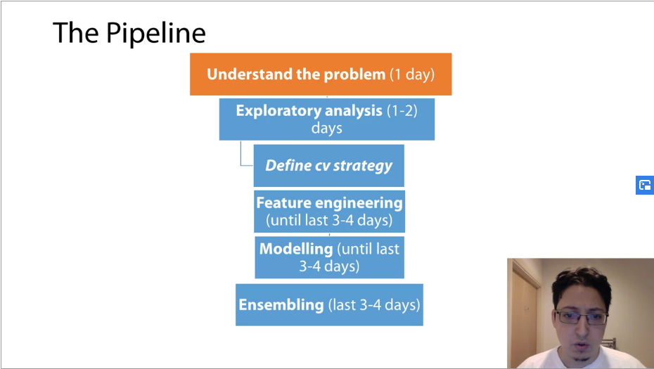
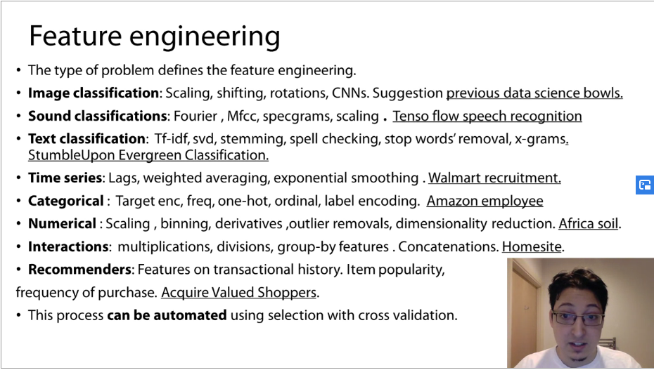
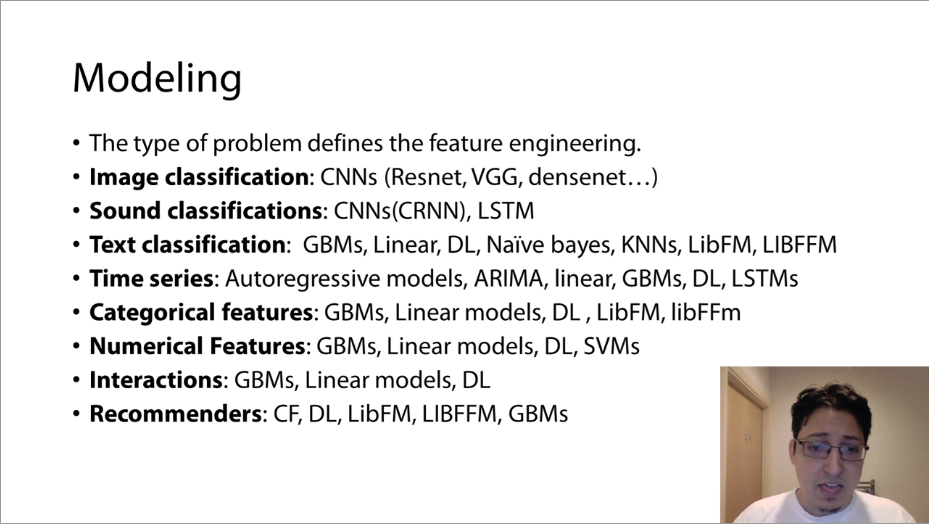

### Hyperparameter Tuning: 
### XGBoost / LightBGM: 
### Random Forest: max_depth, ...
### Tips & Tricks: 
### Before Entering a comptetiion and try to estimate what you can get from your partitipation?: 
- Learn about an interesting problem: lung cancer (Data Science Bowl 2017), seizures prediction (Melbourne Unv Seize Prediction Competition), ...
- To aquant with new software tools: The Nature Conservancy Competition, Amazon images from space (Planet Competition), ...
- Hunt for a medal: 
### After Entering a competition: 
- After getting familiar with the data, write down ideas that you want to try later. After done, read forums and highlight interesting posts and topics. 
- After the initial pipeline is ready and you roll down few ideas, start improving your solution. Sort the ideas into priority order and topics (feature generation, validation, metric optimization, ...). 
- Try to understand why something does/doesn't work: ex: If deep boosting decision tree work then why? Is there hidden data structure we didn't notice before? Maybe you have categorical features with a lot of unique values. If this is the case, we can conclude that mean encoding may work great here.
### Sort the parameter by these priciples: 
- Important
- Feasibility: easy to tune --> hard to tune
- Understanding: rate params from "I know what to do" to "I have no idea"
### Data loading: 
- Do basic preprocessing and convert csv/txt file into hdf5 (pandas files) / npy (numpy arr) for much faster loading.
- Downcast 64-bits array into 32-bits arr to save memory. 
- Large dataset can be processed in chunks.
### Performance Evaluation: 
- Use simple train_test_split. Just use cross-validation when it is needed (ex: reach the limits, only have marginal improvement).
- Start with fastest model - LightGBM. Use early_stopping so don't need to tune boosting iteration (n_tree); Feature Engineering first, just when satisfy with it, then model tuning (sampling, stacking, ...).
### Fast and dirty always better: 
- Don't pay much attention on code quality
- Keep things simple: Save only important things
### Initial Pipeline: 
- Start with simple (even primitive) solution
- Debug full pipeline: from read data to submit result file.
- From simple to complex: start with Random Forest rather than GBDT. 
### Best practices from Software Development
- Use good variable names.
- Keep your research reproducable: fix random seed; write down exacly how any feature were generated;  Use Version Control System (git) to store codes.
- Reuse code: use same code/processing for training and testing stage. --> Move reusable code into functions or even seperate models.
### Read papers.
- Get ideas about ML-related things: (ex: how optimize AUC, ...)
- Get familiar with problem domain (useful for feature generation)
### Pipeline: 
- Read forums and examine kernels first
- Start EDA and a baseline: Check data leakages; do several submission to check if validation score correlate with public leaderboard score.
- Write a list of things to try, and more or less follow it. 
- Try to generate as many features as possible, put them in XGBoost and study what helps and what does not.  
### Hyperparameters optimization: 
- First find parameters that overfitting the training set
- Then change the parameters to constrain the model.
### Very important to have reproducible code: keep important code clean.
### Carefully with execution history: that can chane global variable values.
### Your notebook can be totally a mess unless it is used to submission: Clean code later but use descriptive variable names.
### Use git to control you notebooks. Create a seperate notebook for each submission so that you can run a solution and compare it with others.
### Before submission, restart and run you notebook from top to bottom to make sure everything is ok.
### Split the training set to train and validation set.  Store them and a new folder. When validating model, use new train, validation set; when retraining model, use original train, test set.
### Code organization: 
- Using macro (store many codes in one-line-of-code). 
- Custom library (your self develop library) that implement frequent operations code. (Advanced).

### Pipeline
 

- Understanding broadly the problem (1 day)
  - Type of problem: Type of data? Is there tabular data / categorical data / Time series / does time matter, ...?
  - How BIG is data?
  - Hardware needed? (CPUs, GPUs, RAM, Disk space)
  - Software needed? (sklearn, TF, xgboost, LightGMB, ...)
  - What is the metric?
- EDA (1-2 days)
  - See how consistent training / testing data is? Plot histogram of variables and check that if a feature looks similar in train and test set (big discrepency make troubles).
  - Plot features versus target variable and versus time (if time available). This helps us see how time (day/month/...) affect in the dataset.
  - Binning numerical features and correlation matrices.
- Cross validation strategy (belonds to EDA)
  - This step is critical. 
  - Is time important? Split by time. Time-based validation.
  - Is it totally random? Random validation (random K-Fold).
  - Combine all above.
  - Use test leader board to see if validation score correlate with leaderboard score.
- Feature Engineering (Untill last 3-4 days)
  - Different problems need different feature engineering.

- Modeling

  - Different problems need different modeling.
  - Ensembling: 
    - All this time, prediction on internal validation and test **are saved** (i.e .csv files).
    - Different ways to combine from averaging to stacking.
    - Small data requires simpler ensemble technique (i.e averaging)
    - Bigger data can utilize stacking. Stacking process repeats the modeling process (can be automated to some extent).
  - Tips on collaboration:
    - It make things more fun.
    - You learn more.
    - You score better.
    - Start collaborating after some experience (2-3 competitions) to understand the dynamics.
    - Start with people around your 'rank'
    - Look for people that are likely to do different things well or 'famous' at certain areas. These people will teach will a lot.
  - Selecting a submission:
    - Select best submission locally and best on leaderboard. 
    

    
  
 
  
  
  
  
  
  
  
